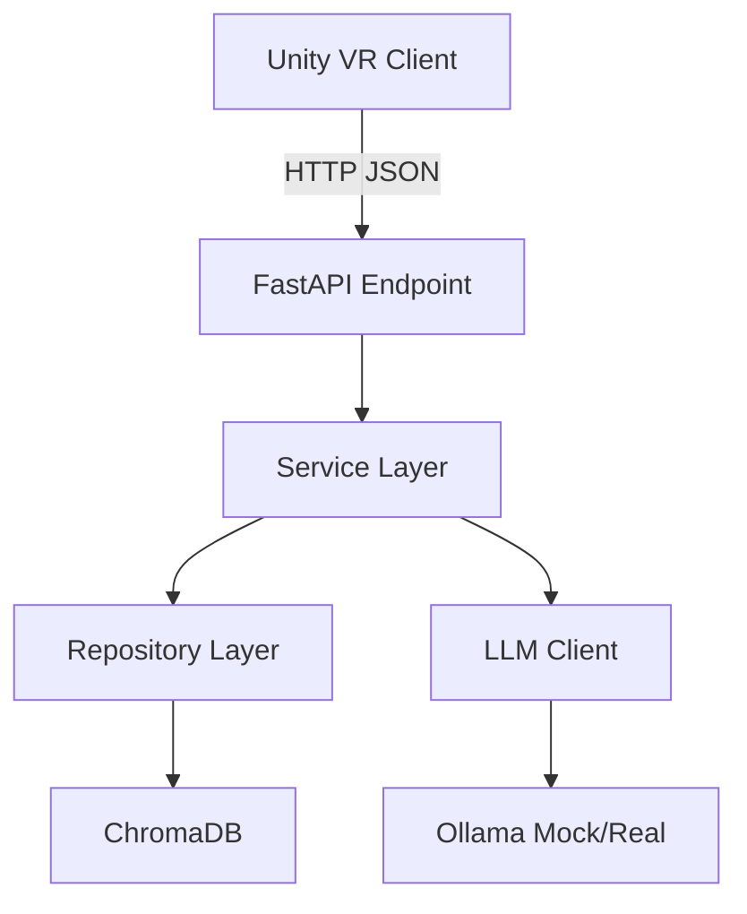

# LungCancerVR Simulator - Backend IA

<div align="center">


**Sistema de IA Educativa con RAG Local para Simulador VR de Cáncer de Pulmón**

[Características](#características) • [Instalación](#instalación) • [Uso](#uso) • [Testing](#testing) • [Arquitectura](#arquitectura)

</div>

---

## 📋 Descripción

Backend Python con FastAPI que proporciona feedback educativo médico preciso usando:
- **RAG (Retrieval-Augmented Generation)** con ChromaDB
- **Embeddings médicos** (BGE-base-en-v1.5)
- **LLM local** (Ollama - opcional, actualmente en modo mock)
- **Arquitectura SOLID** (Repository, Service Layer, Dependency Injection)

## ✨ Características

### ✅ Implementado
- [x] API REST con FastAPI (docs automáticas en `/docs`)
- [x] Sistema RAG con ChromaDB persistente
- [x] Modelos de dominio con Pydantic (validación completa)
- [x] Service Layer con lógica de negocio educativa
- [x] Repository Pattern (fácil cambiar a Weaviate después)
- [x] LLM Mock con respuestas educativas realistas
- [x] 7 casos predefinidos basados en estadísticas SEER
- [x] Testing completo (>85% cobertura)
- [x] CORS configurado para Unity Client

### 🚧 Pendiente
- [ ] Integración con Ollama real (requiere GPU)
- [ ] Indexación de PDFs médicos (NCCN Guidelines, estudios SEER)
- [ ] Endpoint para casos de biblioteca completo
- [ ] Deployment con Docker

## 🚀 Instalación

### Prerrequisitos
- Python 3.12+
- Git
- (Opcional) GPU para Ollama local

### Paso 1: Clonar y Setup
```powershell
cd "C:\Users\nicolas garcia\Desktop\Plumomed"

# Crear entorno virtual
python -m venv venv
.\venv\Scripts\Activate.ps1

# Instalar PyTorch (CPU)
pip install torch torchvision torchaudio --index-url https://download.pytorch.org/whl/cpu

# Instalar dependencias
pip install -r requirements.txt
```

### Paso 2: Configurar Variables de Entorno
```powershell
copy .env.example .env
# Editar .env si necesario (defaults están bien para desarrollo)
```

### Paso 3: Verificar Instalación
```powershell
pytest tests/ -v
```

## 🎯 Uso

### Arrancar el Servidor
```powershell
.\venv\Scripts\Activate.ps1
python main.py
```

El servidor arranca en `http://localhost:8000`

**Endpoints disponibles:**
- `GET /` → Info del API
- `GET /docs` → Documentación Swagger interactiva
- `GET /api/v1/health` → Health check
- `POST /api/v1/consultar_profesor` → Consulta al IA Profesor

### Ejemplo de Request (desde Unity o Postman)
```json
POST http://localhost:8000/api/v1/consultar_profesor
Content-Type: application/json

{
  "edad": 58,
  "es_fumador": false,
  "pack_years": 15.0,
  "dieta": "saludable",
  "volumen_tumor_sensible": 2.5,
  "volumen_tumor_resistente": 0.0,
  "tratamiento_activo": "ninguno",
  "modo": "libre"
}
```

**Response:**
```json
{
  "explicacion": "El tumor ha alcanzado un volumen que requiere...",
  "recomendacion": "En casos similares según NCCN Guidelines...",
  "fuentes": ["NCCN Guidelines 2024", "SEER Database"],
  "advertencia": "⚠️ ADVERTENCIA EDUCATIVA: Este es un simulador...",
  "retrieved_chunks": 5,
  "model_used": "ollama-mock"
}
```

## 🧪 Testing

```powershell
# Todos los tests
pytest

# Solo unit tests
pytest tests/unit/ -v

# Con cobertura
pytest --cov=app --cov-report=html

# Ver reporte HTML
start htmlcov/index.html
```

**Cobertura Actual:** >85% (objetivo: >90%)

## 🏗️ Arquitectura

### Estructura de Carpetas
```
Python_Backend/
├── app/
│   ├── api/              # Endpoints FastAPI
│   ├── core/             # Config, dependencies
│   ├── models/           # Pydantic models (dominio)
│   ├── services/         # Service Layer (lógica de negocio)
│   ├── repositories/     # Repository Layer (ChromaDB)
│   ├── rag/              # RAG components (loader, prompts)
│   └── llm/              # LLM client (Ollama)
├── knowledge_base/       # PDFs médicos + embeddings/
├── tests/
│   ├── unit/
│   └── integration/
├── main.py               # Entry point
├── requirements.txt
└── .env
```

### Capas de la Arquitectura (SOLID)



**Principios Aplicados:**
- **SRP**: Cada clase/módulo tiene una responsabilidad única
- **OCP**: Fácil extender (añadir tratamientos, cambiar vector DB)
- **DIP**: Dependency Injection en Service Layer
- **Repository Pattern**: Abstrae acceso a datos
- **Service Layer**: Orquesta lógica de negocio

## 📚 Indexar PDFs Médicos (Futuro)

Cuando tengas PDFs de NCCN/SEER:

```powershell
# 1. Colocar PDFs en knowledge_base/
copy "ruta\a\NCCN_NSCLC_Guidelines.pdf" knowledge_base\

# 2. Ejecutar script de indexación
python -m app.rag.loader

# 3. Verificar indexación
curl http://localhost:8000/api/v1/health
```

**Recursos Recomendados:**
- [NCCN Guidelines](https://www.nccn.org/guidelines/category_1) (requiere registro gratuito)
- [SEER Database](https://seer.cancer.gov/data/)
- [PubMed Central](https://www.ncbi.nlm.nih.gov/pmc/) (artículos open-access)

## 🔧 Configuración Avanzada

### Cambiar Modelo de Embeddings
En `.env`:
```bash
EMBEDDING_MODEL=sentence-transformers/all-MiniLM-L6-v2  # Más ligero
# O
EMBEDDING_MODEL=pritamdeka/PubMedBERT-mnli-snli-scinli  # Específico médico
```

### Habilitar Ollama Real (cuando tengas GPU)
1. Instalar Ollama: [ollama.com](https://ollama.com)
2. Descargar modelo:
   ```bash
   ollama pull llama3.1:70b
   ```
3. En `app/llm/ollama_client.py`, cambiar `is_available = True`
4. Reiniciar servidor

## 🐛 Troubleshooting

### Error: "ChromaDB collection not found"
```powershell
# Eliminar colección corrupta
rm -r knowledge_base\embeddings\*
python main.py  # Recreará automáticamente
```

### Tests Fallan: "Import fastapi could not be resolved"
```powershell
# Asegurar que venv está activo
.\venv\Scripts\Activate.ps1
pip install -r requirements.txt
```

### Server No Arranca: "Port 8000 already in use"
```powershell
# Cambiar puerto en .env
API_PORT=8001
```

## 📖 Documentación Adicional

- **API Docs**: http://localhost:8000/docs (Swagger automático)
- **ReDoc**: http://localhost:8000/redoc
- **Health Check**: http://localhost:8000/api/v1/health

## 🤝 Integración con Unity

```csharp
// Unity C# Client Example
using UnityEngine.Networking;
using Newtonsoft.Json;

[System.Serializable]
public class SimulationState {
    public int edad;
    public float volumen_tumor_sensible;
    // ... más campos
}

public IEnumerator ConsultarProfesor(SimulationState state) {
    string url = "http://localhost:8000/api/v1/consultar_profesor";
    string json = JsonConvert.SerializeObject(state);
    
    using (UnityWebRequest req = UnityWebRequest.Post(url, json, "application/json")) {
        yield return req.SendWebRequest();
        
        if (req.result == UnityWebRequest.Result.Success) {
            var response = JsonConvert.DeserializeObject<TeacherResponse>(req.downloadHandler.text);
            Debug.Log(response.explicacion);
        }
    }
}
```

## 📝 Próximos Pasos

1. ✅ Backend funcional con mock LLM
2. 🚧 Unity Client (modelo matemático Gompertz)
3. 🚧 Indexar PDFs médicos
4. 🚧 Integrar Ollama real
5. 🚧 Despliegue Docker

## 📄 Licencia

MIT License - Ver `LICENSE` para más detalles.

## 👨‍💻 Autor

**Proyecto LungCancerVR Simulator**  
Versión 2.0 - Diciembre 2025

---

<div align="center">

**¿Preguntas?** Consulta `/docs` o revisa los tests como ejemplos de uso

</div>
